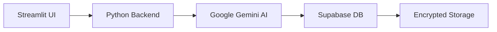

<h1 align="center">🛡️ CyberGuard AI - National Cyber Crime Reporting Portal</h1>
<h3 align="center">AI-Powered Cybercrime Reporting Solution with Gemini Integration</h3>

<p align="center">
  
  
  
</p>

---

## 🌟 Overview

**CyberGuard AI** is a cutting-edge platform designed to revolutionize the way cybercrime complaints are reported, tracked, and managed. By harnessing the power of artificial intelligence—specifically Google’s Gemini AI—this platform offers an intuitive and secure interface for users to submit and monitor cybercrime complaints.

Built with **Streamlit** for a user-friendly frontend and **Supabase** for secure data management, CyberGuard AI ensures that every complaint is processed efficiently, categorized accurately, and handled with the utmost care for user privacy and security.

---

## 🚀 Key Benefits

- 🔍 **AI-Driven Categorization**: Automatically classifies complaints using advanced AI, ensuring swift and accurate processing.  
- 🧑‍💻 **User-Friendly Interface**: Simplifies complaint submission with an intuitive design and support for multiple input methods (text, voice, files).  
- 🔐 **Secure and Private**: Protects sensitive user data with end-to-end encryption and compliance with privacy regulations.  
- 📈 **Real-Time Tracking**: Provides transparency with real-time updates on complaint status.

CyberGuard AI is more than just a reporting tool—it's a comprehensive solution empowering individuals and authorities to combat cybercrime effectively.

---

## 💥 Key Features

- ✅ Submit complaints in **22 Indian languages** via **text, voice (STT)**, or **file uploads (PDF/Images)**  
- ✅ **AI categorization** of complaint type using **Google Gemini**  
- ✅ Real-time complaint **ticket generation and tracking**  
- ✅ Multilingual **confirmation email** with official ticket number  
- ✅ Built-in **speech-to-text**, **OCR**, and **language translation**  
- ✅ Admin dashboard for **status update**, **ticket view**, and **filters**  
- ✅ Streamlit UI with **tabs**, **themed display**, and **structured workflows**  
- ✅ Supabase: secure backend for data storage, auth, and ticket logs  
- ✅ OTP login (optional), email notifications (optional), single-file app  

➡️ **Complaint Flow**:  
👤 **User** → 🔐 **Secure Login** → 🤖 **AI Chatbot** → 🧠 **Automated Categorization** → 📊 **Real-Time Tracking**

---

## 🔑 Core Features

| Category        | Features                                                                      |
|-----------------|-------------------------------------------------------------------------------|

| **AI Capabilities** | Processing • Auto-Categorization • Detail Extraction                        |
| **User Experience** | Voice/Text Input • Multi-Language UI • Real-Time Dashboard                   |

---

## 🛠 Tech Stack



---

## 🏗️ Architecture

```text
+---------------------+
|  Presentation Layer |
|  (Streamlit UI)     |
+---------------------+
          ↓
+---------------------+
|   Business Logic    |
|  (Python/Flask)     |
+---------------------+
          ↓
+---------------------+
|   AI Processing     |
|    (Gemini AI)      |
+---------------------+
          ↓
+---------------------+
|  Data Persistence   |
|  (Supabase PG)      |
+---------------------+
```

---

## 🚀 Quick Start

### 1. Install dependencies:

```bash
pip install -r requirements.txt
sudo apt-get install portaudio19-dev
```

### 2. Configure environment:

```env
# .env file
SUPABASE_URL=https://your-instance.supabase.co
GEMINI_API_KEY=your_ai_key
```

### 3. Launch application:

```bash
streamlit run app.py --server.port 8501
```

---

## 🗂 Project Structure

```
CyberGuardAI/
├── app.py              # Main application logic
├── requirements.txt    # Python dependencies
├── .env.example        # Environment template
└── README.md           # Documentation

Supabase Schema:
users (id, username, email, password_hash)
complaints (ticket_id, category, status, evidence)
```

---

## 🤖 AI Workflow

> **Example**: User reports "Phishing email from fake bank"  
> ✅ Gemini analyzes text  
> ✅ Classifies as "Financial Fraud"  
> ✅ Extracts key details (sender, content)  
> ✅ Generates investigation tips

---

## 🌐 Deployment Options

| Platform         | Instructions                                                                 |
|------------------|------------------------------------------------------------------------------|
| Streamlit Cloud  | [](https://streamlit.io/cloud) |

**Steps**:
1. Push to GitHub: Upload code to a GitHub repository.  
2. Connect to Streamlit Cloud: Link your repo in the Streamlit dashboard.  
3. Configure Secrets: Add API keys (e.g., Supabase, Gemini) securely.  
4. Deploy: Launch the app with one click.

> ✅ Alternative: Docker or VPS for custom hosting.

---

## 🔗 Links

- 🎬 [Demo Video on Google Drive](https://drive.google.com/drive/folders/1DyI5qzy40ks3LV69vTq5YpW-f8gLjbCL)

---

## 🔌 API Integrations

- **Google Gemini AI**: Categorization and NLP capabilities  
- **Supabase**: Database, authentication, and secure storage  
- **SpeechRecognition**: Voice-to-text conversion (optional)  
- **gTTS**: Text-to-speech (optional)  
- **ReportLab**: PDF report generation

> These integrations power CyberGuard AI’s smart automation features.

---

<p align="center">
  Built for 🇮🇳 India | Empowering citizens against digital crime 💻🔒
</p>

---

## 🙏 Acknowledgments

- Google Gemini Team  
- Streamlit Developers  
- Supabase Community  
- Python Software Foundation  

